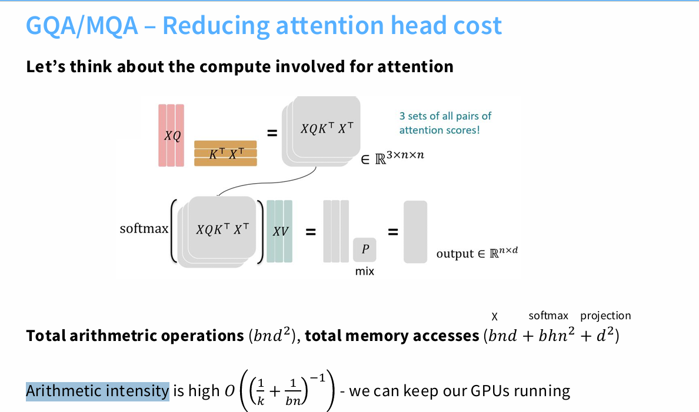
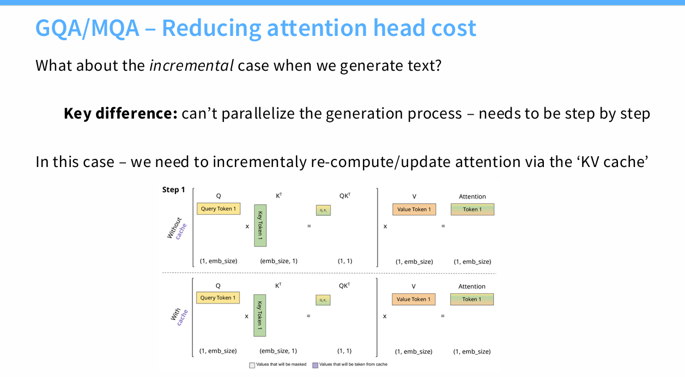
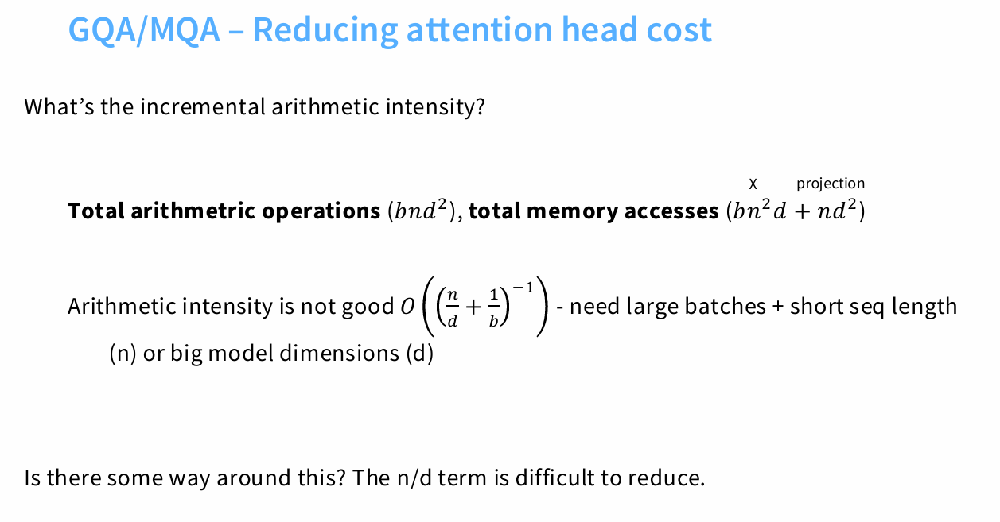
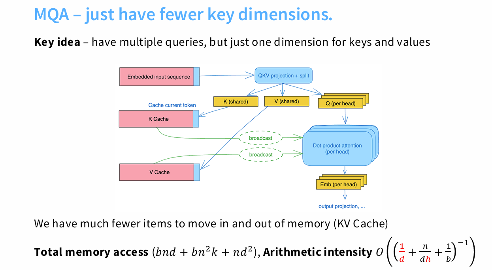
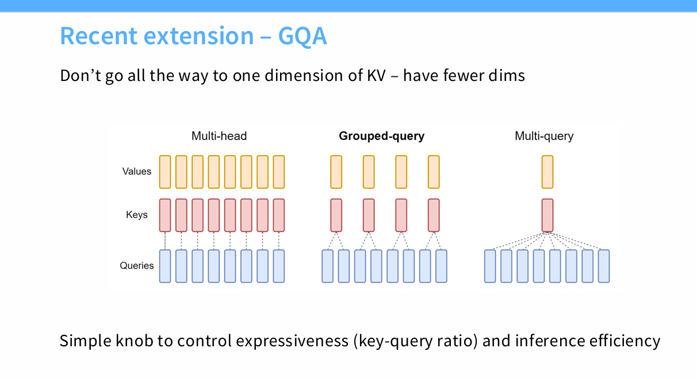
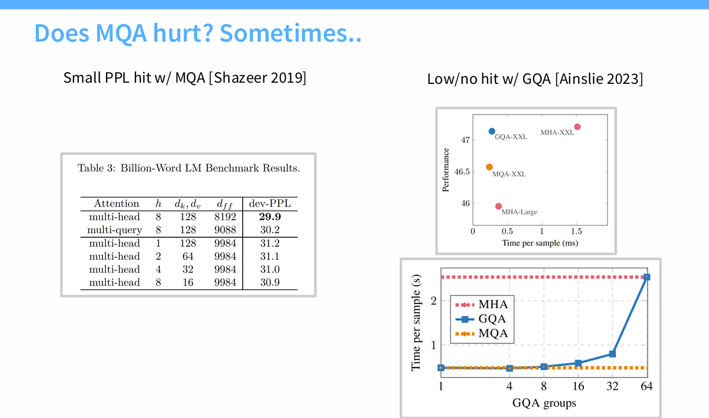

1. 为什么使用MQA， GQA
推理阶段需要使用kv cache，但会带来问题，https://zhuanlan.zhihu.com/p/686149289
比如L层，b * n * d的输入，缓存量就是
L*b*n*d（num of heads * head size）*2(k\v)*2(2byte)会超过gpu缓存上限。所以就借助GQA MQA。gqa是综合效果最好的。
缓存量变为：L*b*n*（num of heads * head size）*2(k\v)*2(2byte)

另一个角度，从Arithmetic intensity（越高越好）

2. MQA vs GQA

