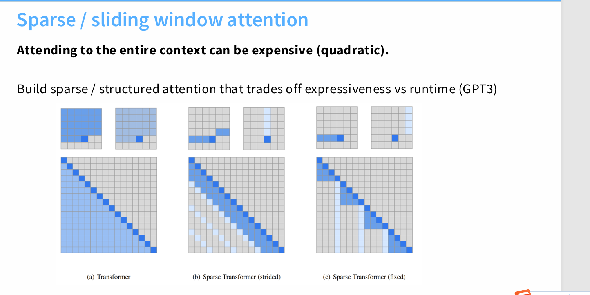
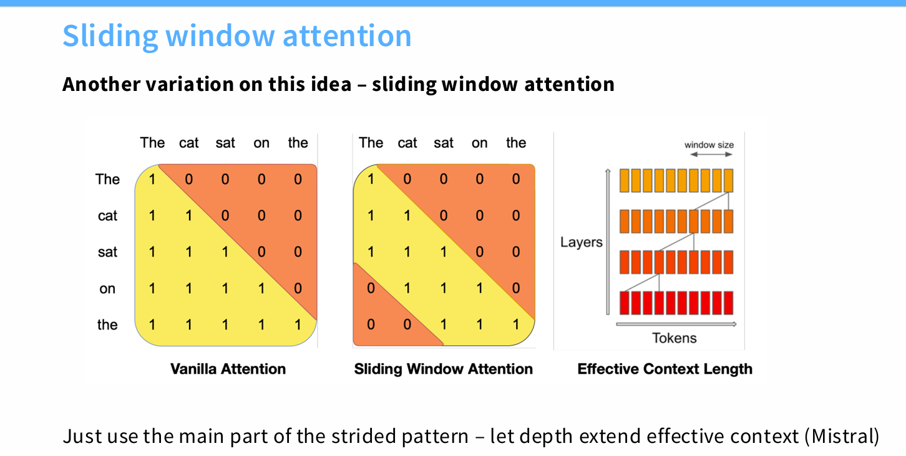
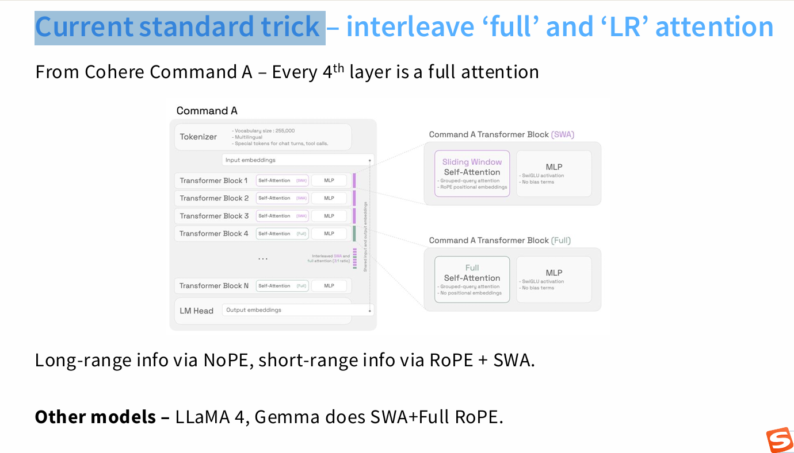

如何让context更长？（时间复杂度和算力）
1. sparse window attention

2. sliding window attention

3. Current standard trick （因为普通的selfattention模块少了，所以优化了性能；同时还加入了sliding window）
（SWA结合RoPE（旋转位置嵌入）有效处理短距离依赖，提供高效的局部上下文理解。
每第四个全注意力块（Full）捕捉全局依赖，确保模型不会丢失长距离信息（如文档开头和结尾之间的关系），提高整体语义理解能力。)
(no-positional embedding，一方面是因为rope本来就是在注意力层进行的，不是在embedding时进行的)
