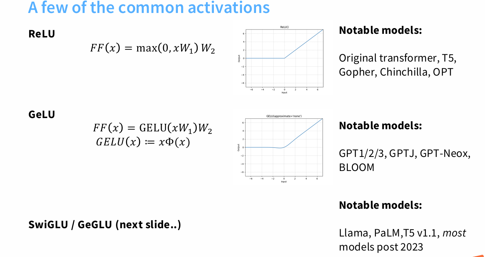
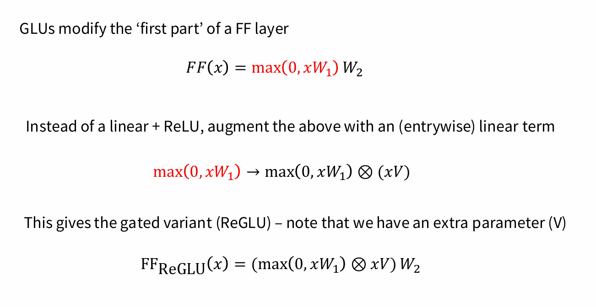
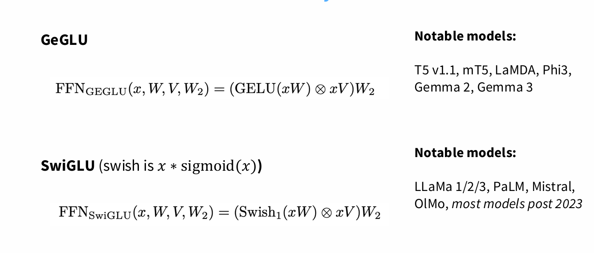

一、为什么需要激活函数，作用是什么，应该放置在哪里
1. 为什么需要激活函数

如果没有激活函数，神经网络中的每一层只做线性变换：
y=Wx+b

无论堆叠多少层，最后仍然是一个线性函数，表达能力非常有限（本质上只等于一层线性回归/线性分类器）。

激活函数的作用就是引入非线性，让神经网络能够逼近任意复杂的函数（这是“通用逼近定理”的核心）。
2. 激活函数的作用

激活函数主要有以下几个作用：

引入非线性：使网络能够学习和表示复杂的模式，而不仅仅是线性关系。

限制输出范围：例如 sigmoid 把值压缩到 (0,1)，便于做概率建模。

稀疏表示：像 ReLU 会让一部分神经元输出 0，产生稀疏性，减少计算量，提高泛化能力。

梯度传播：有的函数能让梯度在反向传播中保持稳定，避免梯度消失或爆炸（如 ReLU、Leaky ReLU、GELU 相比 sigmoid/tanh 更稳定）。

3. 激活函数应该放在哪里

通常的规则是：

放在线性层（全连接、卷积等）之后，使得线性变换结果变得非线性。
h=σ(Wx+b)

不要在输出层随意加激活，而是根据任务决定：

分类任务：输出层常用 softmax（多分类） 或 sigmoid（二分类）。

回归任务：通常输出层 不加激活，直接输出一个实数。

二、activations

三、gated activations（*glu）

四、gate作用
