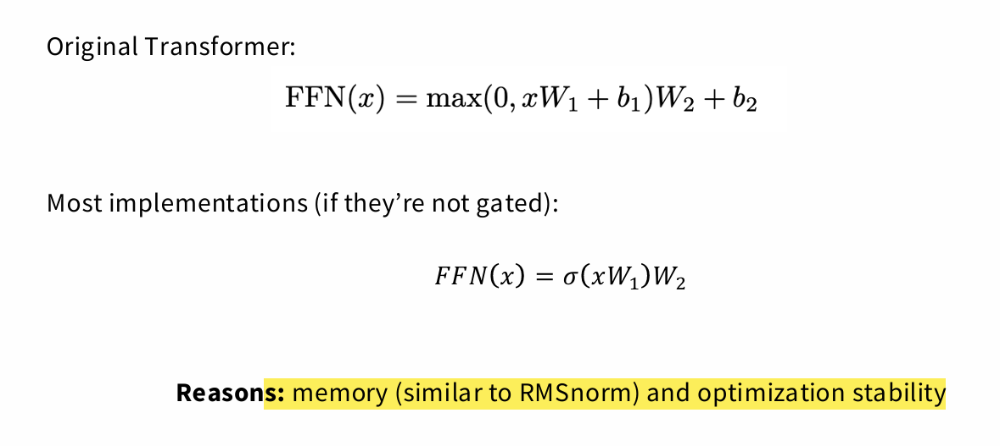

特殊结构层：信息提取器
你提到的这些“特殊结构”层，比如：

卷积层 (Convolutional Layers)：它们专门处理图像数据，通过局部感受野和权值共享来高效地提取空间特征，如边缘、纹理和形状。

循环神经网络 (RNN) 或长短期记忆网络 (LSTM)：它们擅长处理序列数据，通过记忆历史信息来提取时间特征和上下文信息。

注意力机制 (Attention Mechanisms)：它们能动态地捕捉序列中词语之间的全局依赖关系，无论词语距离多远。

图神经网络 (GNNs)：它们专门处理图结构数据，通过“消息传递”机制来提取节点之间的关系特征。

这些层的共同点是，它们都针对特定类型的数据结构（图像、序列、图等）进行了优化，能够高效且智能地从这些结构中提取有意义的、高层次的特征。

全连接层（MLP）：信息整合与决策
全连接层（MLP）通常位于这些特殊结构层的末尾，扮演着信息整合和最终决策的角色。

信息整合：特殊结构层提取出的特征，无论它们来自图像、文本还是图，最终都会被“展平”成一个向量。全连接层接收这个向量，并对所有特征进行全面的组合和非线性变换。它不像卷积层只关注局部，而是会综合所有特征，学习它们之间更复杂的、全局性的关系。

决策输出：通过多层的全连接层，模型最终将整合后的特征映射到最终的输出空间。这可以是分类任务的概率分布（比如识别图片中的物体），也可以是回归任务的具体数值（比如预测房价），或是其他类型的输出。

