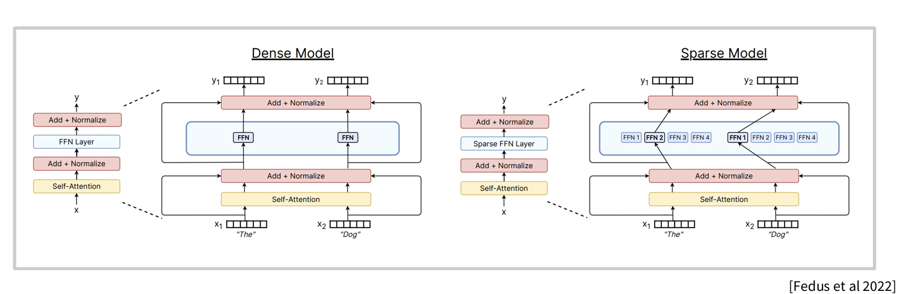

1. 如果不考虑资源，moe是不是就没用了，不如dense model
reddit上一个观点
```
我们先从一个采用 FP16（半精度浮点数）精度的密集型神经网络说起（这一点很快会显得很重要）。假设这个网络有 100 亿个参数。

现在，如果我们采用 “量化感知训练”（Quantization Aware Training），将所有参数从 FP16 精度降至 Int8（8 位整数）精度，最终模型性能只能达到全精度（FP16）版本的 80% 左右（这一结论源自《Scaling Laws for Precision》一文）。换句话说，我们可以认为，这个 Int8 精度的模型虽然内存占用减少了一半，但 “实际等效” 的参数规模也只剩 80 亿。或者，我们也可以构建一个参数规模增加 20% 的模型 —— 比如一个 120 亿参数的 Int8 模型，其 “实际等效” 参数规模就能达到 100 亿。

这听起来可能像是个不相关的突兀话题，但混合专家（MoE）模型对密集型神经网络的 “近似” 方式，与上述量化过程有着相似逻辑（相关依据可参考《Approximating Two Layer Feedforward Networks for Efficient Transformers》一文）。举个例子，假设有一个 100 亿参数的 MoE 模型，若仅有 1/8 的参数处于激活状态（即 7/8 的参数处于稀疏状态），那么我们可以认为，这个稀疏的 MoE 模型正在近似模拟一个参数规模相同的密集型网络的特性。

这就形成了一种特殊的缩放规律：在保持激活参数数量不变的前提下，我们可以持续增加模型的总参数规模，同时还能提升这些激活参数的 “价值”（这种 “价值” 与模型总参数规模呈函数关系，更多细节可参考《Scaling Laws for Fine Grained Mixture of Experts》一文）。

正是因为这些激活参数是更大系统的一部分，它们才能够实现功能特化。我们采用 MoE 架构的核心原因在于：普通的密集型网络本质上已经是稀疏的了！在一次前向传播过程中，实际上只有约 20%-50% 的模型参数处于激活状态，但由于所有神经元的分布是随机的，很难在 GPU 上对这类计算进行加速。因此，我们采用 MoE 架构，更多是为了将这些神经元整理成连续的模块，这样就能直接忽略那些未激活的模块，从而实现计算加速。

总之，混合专家（MoE）模型的性能很难精确界定，但对于 Mixtral 风格的 MoE 模型（采用 softmax 函数 + top-k 选择机制，且我记得还加入了丢弃法），有一个大致适用的经验法则：其性能约等于激活参数数量与总参数数量乘积的几何平均数，也就是√(激活参数数量 × 总参数数量)。

举个例子，若一个 MoE 模型的激活参数为 200 亿、总参数为 1000 亿，理论上，这个模型的性能表现大致相当于一个 440 亿参数的密集型模型。

当然，这个法则并非绝对完美，而且现代 MoE 模型的性能已经比这一估算要好得多，但它依然是一个很实用的参考标准。

说到底，MoE 模型的优势在于，它突破了大语言模型（LLM）性能缩放过程中的一个根本性限制：

密集型 LLM 的性能会受到模型可调用带宽的硬性限制 —— 没错，你可以通过批量处理（batching）将瓶颈转移到计算层面，但批量处理对 MoE 模型同样适用（只需将稀疏系数乘以密集型模型所需的批量处理规模即可）。而 MoE 模型的核心优势，就在于它能突破上述带宽带来的根本性限制。

举个具体的例子：假设某款 GPU 的性能是 CPU 的 8 倍，若在 CPU 上运行一个激活参数仅为 GPU 模型 1/8 的 MoE 模型…… 理论上，两款设备的运行速度会大致相当，但从性能表现来看，CPU 上的这个 MoE 模型预计能达到 GPU 模型 3/8 参数规模的效果。

那么，我们该如何客观看待 MoE 模型？它们是否只是 “参数规模达标但质量不足” 的模型？以 Qwen 235B（通义千问 235B）为例，它的性能确实不如同参数规模的密集型模型。但另一方面，它的运行门槛比 70B 参数的密集型模型更低 —— 比如在消费级设备上，若采用相同的量化精度，Qwen 235B 的生成速度能达到每秒 3 个 token，而 70B 密集型模型仅为每秒 1.7 个 token。

因此，对 MoE 模型的评价取决于你的视角：从总参数规模来看，它们的性能可能不尽如人意；但从激活参数规模来看，它们的表现堪称惊艳。通常，人们的评价视角与其拥有的硬件设备以及对 MoE 模型的认知程度密切相关。那些对 MoE 模型了解不深、却拥有大量 GPU 资源的人，往往会将 MoE 模型视为 “特殊异类” 并对其进行负面评价，认为它们性能不佳…… 某种程度上，这种评价也并非完全没有道理 —— 若按每单位显存的性能来算，MoE 模型的性价比确实相对较低。

但 MoE 模型真正独特且强大的地方在于：它们能以 “CPU+GPU 协同” 的方式流畅运行，而这是其他类型的模型难以实现的。就我个人而言，我更倾向于这样看待 MoE 模型：从 “每次前向传播中被动参数（即未激活参数）的贡献” 来看，它们让我的 GPU 变得更具 “价值”。
```
即，无论dense还是moe，都是得到了一个参数量比总参数量小的激活模型。
但也有很多观点认为，moe的效果略差于dense，而且除了ds，llama4等都效果不好。moe关键还是在于更好训练，就算有其他的不足，当参数太大，如果资源不够，也只能进行moe了

2. moe


3. 相同flops，moe模型更快、效果更好，但系统复杂性更大（基础架构复杂+router难以训练）（因为router是离散的，无法靠梯度反向传播优化）

直接看课件pdf就行了