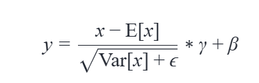
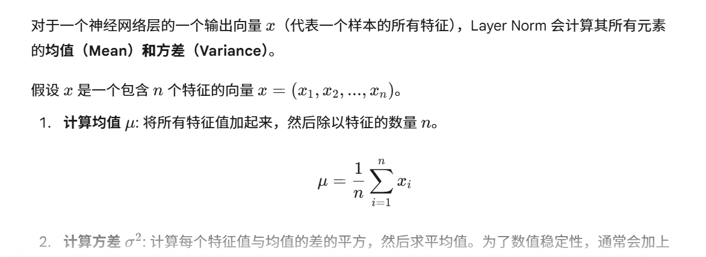
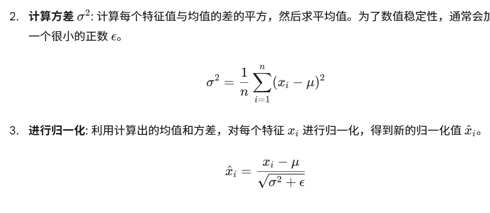
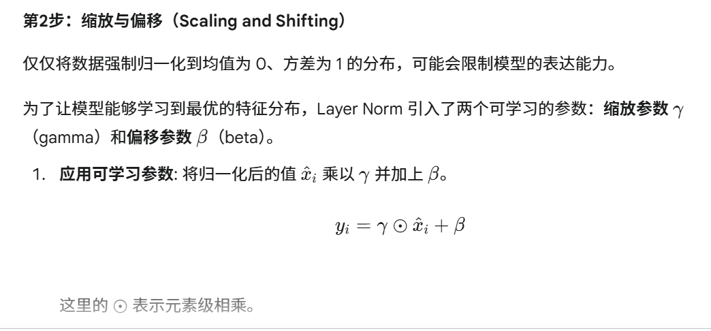
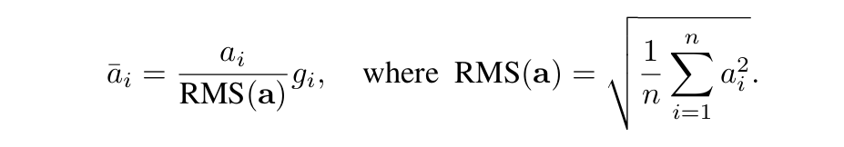
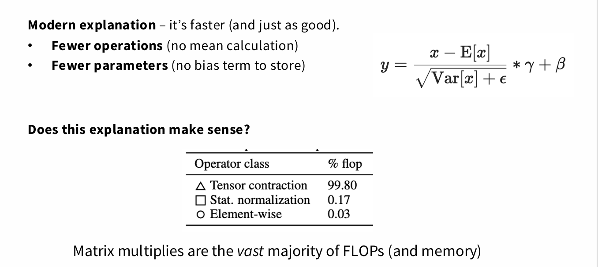
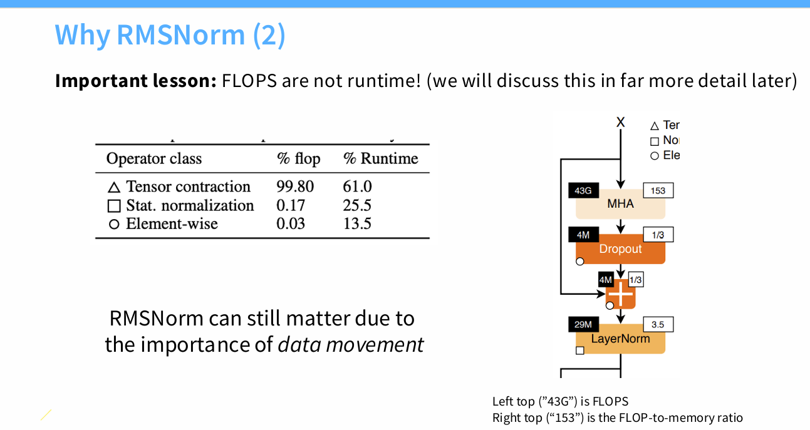
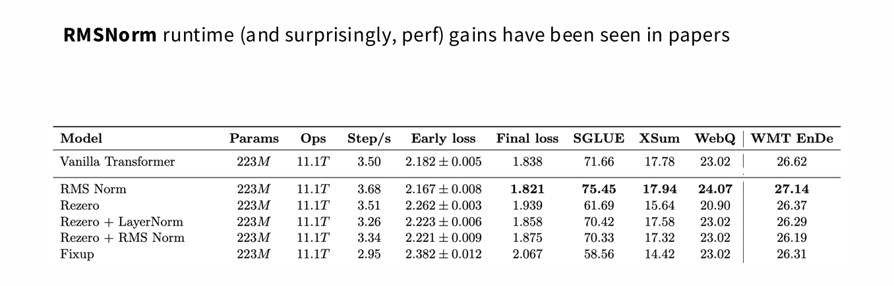

一、为什么需要norm？
1. 解决 Internal Covariate Shift
这是提出 Batch Normalization (BN) 时最核心的理由。

当我们在训练神经网络时，每一层的参数都在不断更新。这就导致一个问题：前一层的输出分布（也就是下一层的输入分布）会随着训练的进行而不断变化。这种变化，我们称之为 Internal Covariate Shift。

这个现象会带来什么问题呢？

训练变慢：每一层都需要不断地适应前面层不断变化的输入分布，就像一个学生需要不停地适应老师改变的讲课方式。这会使得模型的训练收敛速度变慢。

需要更小的学习率：为了避免训练过程中的不稳定性（比如梯度爆炸），我们不得不使用更小的学习率，这又进一步拖慢了训练速度。

Norm 的作用，就是将每一层的输入（或输出）分布固定在一个稳定的范围内（通常是均值为 0，方差为 1），从而缓解 Internal Covariate Shift，让每一层都能够更独立地学习，训练效率大大提升。（归一化的核心作用，就是将每一层的输入（或输出）限制在一个固定的、稳定的分布范围内，通常是均值为0、方差为1。

稳定输入分布：归一化消除了 Internal Covariate Shift，确保了每层的输入分布不会随着训练而剧烈变化。这使得激活函数的导数（f 
′
 (z)）始终保持在一个健康的、非极端的范围内，避免了其值过大或过小。

控制参数更新：归一化让我们可以使用更大的学习率而不必担心发散，因为梯度的值被有效地控制住了。）

2. 让模型更稳定
没有 Norm 的神经网络，尤其是深层网络，很容易出现 梯度消失 或 梯度爆炸 的问题。

梯度消失：当网络很深时，如果梯度在反向传播过程中不断变小，会导致前面的层几乎无法更新参数，训练停滞。

梯度爆炸：反之，如果梯度不断变大，参数更新就会非常剧烈，导致训练过程发散，模型无法收敛。

Norm 通过将数据缩放到一个稳定的范围，有效地控制了梯度的幅值，防止其在反向传播时过大或过小，使得训练过程更稳定。

3. 简化超参数调整
通过使用 Norm，我们可以使用更高的学习率而不用担心训练发散。这使得超参数的调整变得更简单，因为我们不需要花大量时间去寻找一个非常小的、合适的学习率。

二、LayerNorm怎么做到归一化
公式：

总而言之，Layer Norm 通过以下两步完成：

在单个样本内部，对所有特征计算均值和方差，并将特征值标准化到均值为 0、方差为 1 的分布。

引入可学习的缩放参数 γ 和偏移参数 β，让网络可以灵活地将归一化后的分布调整到最佳状态。

三、RMSNorm

rmsnorm作者提出假设：层归一化成功的关键在于重新缩放不变性，而非重新中心化不变性。

四、为什么都使用rmsnorm而不是layernorm

