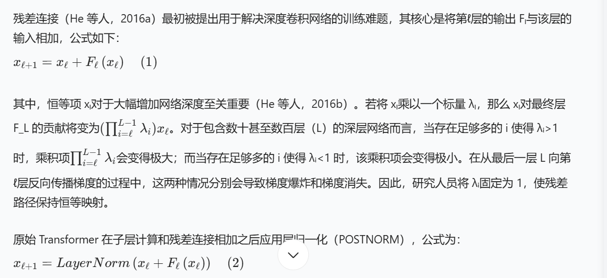
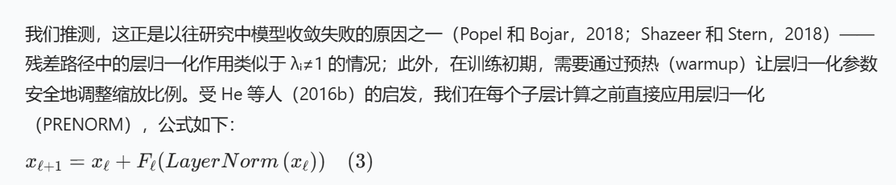
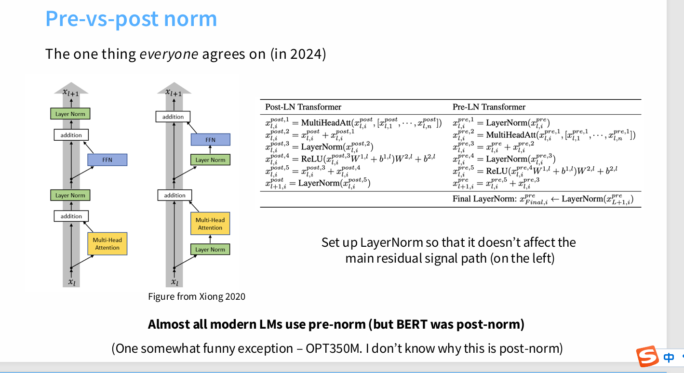
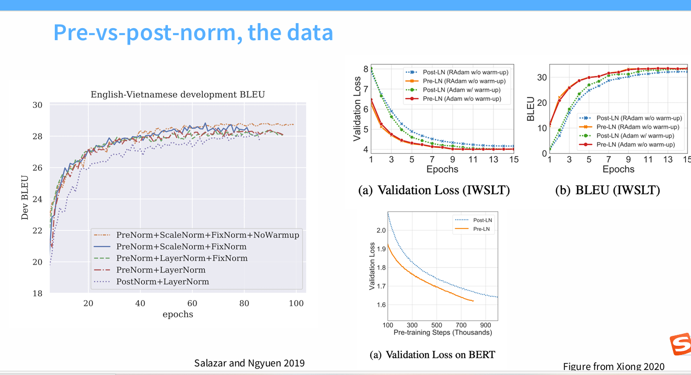
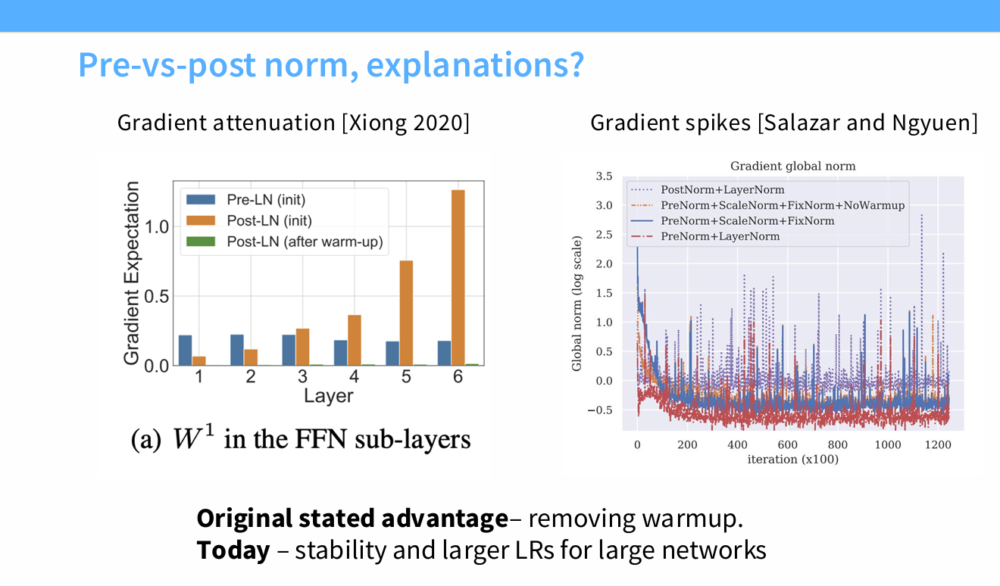

Post-LN Transformer 中，靠近输出层的参数梯度范数较大，且随着层索引l的减小，梯度范数可能会衰减；相反，Pre-LN Transformer 中，任意层l的梯度范数都可能保持一致。基于上述分析，我们推测梯度规模是 Post-LN Transformer 需要精细学习率调度的原因之一 —— 由于部分层的梯度较大，若不进行预热而直接使用大学习率，可能导致训练不稳定，而预热阶段能有效避免这一问题。但收敛速度会显著减慢。因此 Pre-LN Transformer 可以省去预热阶段。实验结果表明，在多种应用场景下，无需预热阶段的 Pre-LN Transformer 能达到与基准模型相当的性能，同时显著缩短训练时间并减少超参数调优工作。

另一篇论文给出的解释：

结果显示，即使在训练后期，POSTNORM 仍会产生带有大量尖锐峰值的噪声梯度；而 PRENORM 的梯度噪声更少、规模更小，且在无预热时仍保持稳定。：
（在尖锐峰值下的梯度特性。如果梯度估计里带有噪声（如 SGD 的 mini-batch 采样噪声），那么参数会在尖锐的山谷中被不断“震荡”。
直观上：在 平坦的极小值 (flat minima) 中，噪声对梯度影响不大，参数依然留在谷底附近。在 尖锐的极小值 (sharp minima) 中，噪声会导致参数容易被“推”出谷底，从而不稳定。）
因此，也是prenorm的优点之一。
(即无法收敛到全局最低点)
（为什么尖锐峰值通常与差的泛化能力相关？
除了收敛困难，学术界普遍认为，收敛到尖锐峰值的模型通常泛化能力较差。一个流行的理论是：
训练集与测试集的分布差异：训练集和测试集的损失函数曲面虽然相似，但不会完全重合。可以想象成两张非常相似但有细微错位的地图。
尖锐峰值的脆弱性：如果你的模型收敛到了训练集地图上的一个尖锐谷底，那么在测试集的地图上，这个谷底的位置可能已经发生了轻微的偏移，甚至可能不再是谷底，而是一个山坡。因此，模型在测试集上的表现会急剧下降。
平坦最小值的鲁棒性：相比之下，如果模型收敛到一个“平坦且宽阔”的最小值（Flat Minima）区域，即使测试集的地图有轻微偏移，模型依然处在一个很低的损失区域内。因此，收敛到平坦最小值的模型通常具有更好的鲁棒性和泛化能力。）
