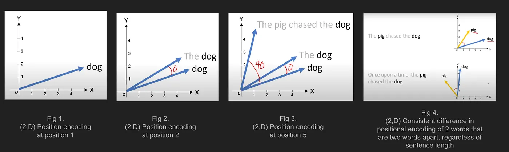
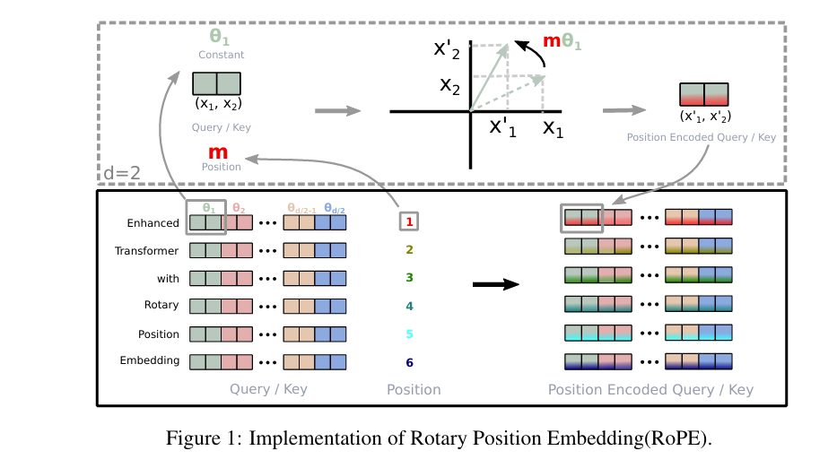
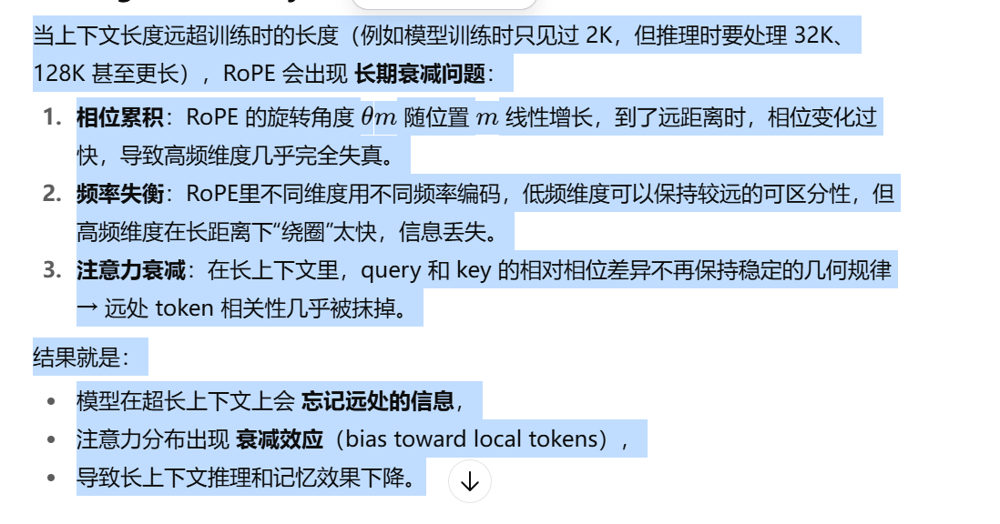
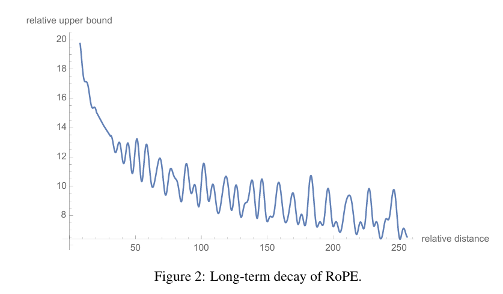
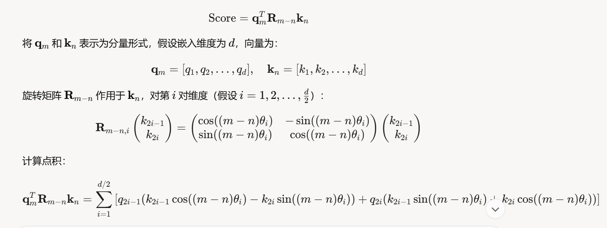
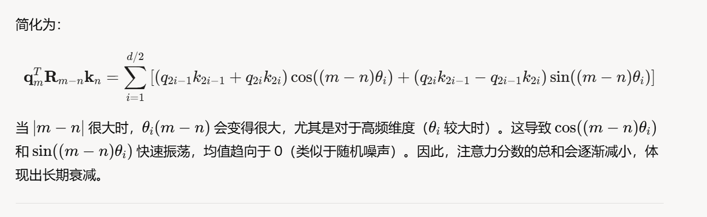

#### 为什么使用rope而不是绝对位置编码？
answer：1.模型真正需要理解的是一个词与另一个词之间的相对距离，而不是它在序列中的绝对位置。RoPE则直接通过旋转矩阵的方式，将相对位置信息融入到注意力机制的计算中。当计算词语 A 和 B 之间的注意力得分时，RoPE会通过旋转操作，使得最终的注意力得分只依赖于 A 和 B 之间的相对距离，而不是它们的绝对位置。这种设计从根本上解决了相对位置信息的编码问题，让模型能更自然、更高效地理解词语之间的关系。
2.更好的泛化能力（外推）
在训练时，模型的序列长度通常是固定的。例如，我们可能用长度为512的序列来训练一个模型。但是，在推理时，我们可能需要处理更长的序列，比如1024或2048。
绝对位置编码在面对超出训练范围的序列长度时，会遇到一个难题：模型没有见过这些新的位置编码，因此无法对它们进行有效的处理。这会导致模型在处理长序列时性能下降，即泛化能力差。
RoPE则没有这个限制。由于它的核心思想是基于相对距离，即使序列长度变长，它也只需要计算词语之间新的相对距离即可，而这套计算逻辑在训练时就已经学会了。因此，RoPE能够很好地泛化到更长的序列上，即使这些长度在训练时从未出现过。这对于处理长文本任务，如长篇小说或代码，尤为重要。


https://medium.com/@ngiengkianyew/understanding-rotary-positional-encoding-40635a4d078e
这个blog可以找找感觉

讲解：
传统的位置编码（如BERT中的`sin/cos`编码）是将位置信息**加**到词向量上。RoPE另辟蹊径，它的核心目标是找到一种方式，将位置信息**融入**到Query (q) 和 Key (k) 向量中，使得经过位置编码后的`q`和`k`的内积（点积）能够**仅由它们的相对位置决定**。
用数学语言来描述这个目标就是：
寻找一个变换函数`f`，使得对于任意词向量`x_m`和`x_n`（分别在`m`和`n`位置），它们经过变换后的向量`q_m = f(x_m, m)`和`k_n = f(x_n, n)`的内积，等于另一个只与`x_m`, `x_n`和相对位置`m-n`相关的函数`g`。
即：
`<f(x_m, m), f(x_n, n)> = g(x_m, x_n, m-n)`
这个公式是整个推导的出发点。它意味着，内积结果（即注意力分数的核心部分）中蕴含的距离信息只和相对位置`m-n`有关，而与绝对位置`m`和`n`无关。

### 从二维开始：最直观的几何解释
直接在高维空间寻找解`f`很困难，所以论文作者从最简单的二维(2D)空间开始寻找灵感。
1.  **用复数表示二维向量**：
    任何一个二维向量`(x, y)`都可以表示成一个复数 `x + iy`。在复平面上，对一个向量进行旋转，最方便的运算就是乘以另一个复数 `e^(iθ)`。
2.  **设定变换函数的形式**：
    基于复数的旋转特性，作者假设变换函数`f`就是将原始的词向量`W_q * x_m`（这里先忽略线性变换`W_q`，把它看作`x_m`）乘以一个与位置`m`相关的旋转因子`e^(imθ)`。
    *   `q_m = f(x_m, m) = (W_q * x_m) * e^(imθ)`
    *   `k_n = f(x_n, n) = (W_k * x_n) * e^(inθ)`

    这里的 `θ` 是一个预先设定的常数。
3.  **计算内积，验证目标**：
    现在我们来计算`q_m`和`k_n`的内积。在复数域中，内积对应于一个复数乘以另一个复数的共轭 (`*`表示共轭)。
    `<q_m, k_n> = Re[q_m * k_n^*]` (Re[]表示取实部)
    
    代入上面的定义：
    `q_m * k_n^* = [(W_q * x_m) * e^(imθ)] * [(W_k * x_n) * e^(inθ)]^*`
    `= (W_q * x_m) * (W_k * x_n)^* * e^(imθ) * e^(-inθ)`
    `= (W_q * x_m) * (W_k * x_n)^* * e^(i(m-n)θ)`

    观察这个结果！最终的式子只包含了相对位置 `m-n`。取其实部后，我们得到：
    `<q_m, k_n> = Re[ (W_q * x_m) * (W_k * x_n)^* * e^(i(m-n)θ) ]`

    这完美地满足了我们最初设定的目标 `g(x_m, x_n, m-n)`。

    **这个二维推导的核心思想是：通过将绝对位置`m`编码为一个旋转角度`mθ`，两个向量的内积结果自然地只依赖于它们之间的角度差`(m-n)θ`，从而巧妙地引入了相对位置信息。**

### 从二维到高维：分组旋转
现在的问题是如何将这个漂亮的二维解法推广到任意`d`维（假设`d`为偶数）的向量空间。
RoPE的做法非常直接：**将`d`维向量两两一组，看作是`d/2`个独立的二维空间，然后在每个二维空间内应用上述的旋转操作。**
1.  **向量分组**：
    一个`d`维的向量`x = (x_1, x_2, x_3, x_4, ..., x_{d-1}, x_d)`被看作是`d/2`个二维向量的组合：`(x_1, x_2)`, `(x_3, x_4)`, ..., `(x_{d-1}, x_d)`。
2.  **应用不同的旋转角度**：
    为了增加模型的表达能力，我们不希望所有二维子空间都用同一个旋转角`θ`。因此，RoPE为每个二维子空间分配了不同的旋转角 `θ_i`。
    
    `Θ = {θ_i = 10000^(-2(i-1)/d), i ∈ [1, 2, ..., d/2]}`
    
    这个`θ_i`的设计借鉴了原始Transformer的`sin/cos`编码，`θ_i`的值随着维度`i`的增加而减小，这意味着高频信息（变化快）被编码在低维部分，低频信息（变化慢）被编码在高维部分。

3.  **写成矩阵形式**：
    对每个二维子空间 `(x_{2i-1}, x_{2i})` 应用旋转`mθ_i`，可以写成一个2x2的旋转矩阵：
    ```
    [ cos(mθ_i)  -sin(mθ_i) ] [ x_{2i-1} ]
    [ sin(mθ_i)   cos(mθ_i) ] [ x_{2i-1} ]
    ```
    将这`d/2`个2x2的旋转矩阵组合起来，就形成了一个`d x d`的分块对角矩阵 `R_m`。这个`R_m`就是RoPE的位置编码矩阵。

    `f(x_m, m) = R_m * (W_q * x_m)`

4.  **高维内积的性质**：
    由于`R_m`是正交矩阵（旋转矩阵都是正交矩阵），它有一个重要性质：`R_m^T * R_n = R_{n-m}`。
    因此，经过RoPE编码后的`q_m`和`k_n`的内积为：
    `<q_m, k_n> = (R_m * W_q * x_m)^T * (R_n * W_k * x_n)`
    `= (W_q * x_m)^T * R_m^T * R_n * (W_k * x_n)`
    `= (W_q * x_m)^T * R_{n-m} * (W_k * x_n)`

    可以看到，最终的内积公式中，位置信息也被整合成了只与相对位置`n-m`（或`m-n`）相关的旋转矩阵`R_{n-m}`，成功地将二维的解推广到了高维。


具体paper里有理论证明部分，即从公式推导得出(3.4)


#### q1： 为什么rope作用在自注意力层，而不是一开始的embedding
RoPE的整个数学推导都是为了一个目标：
< f(x_i, i), f(x_j, j) > = g(x_i, x_j, i-j)
这里的 < , > 就是点积运算。这个公式本身就决定了RoPE必须作用在即将进行点积运算的两个向量上，也就是Q和K。
如果在Embedding层就进行旋转，那么后续Q和K的生成过程 (Q_i = RotatedEmbedding_i * W_q) 会破坏掉RoPE精巧的数学结构。旋转后的向量再经过一次线性变换，其点积结果就不再能保证只和相对位置有关了。


#### 代码(并不是使用旋转矩阵的方式，而是论文3.4.2部分的高效计算，即把这个rope看成是对query、key中任意两个相邻的维度的二元组进行选择，即乘以cosmθ+siniθ)
代码方法：
我们的向量：z_q = x + iy
我们的旋转操作：z_rot = cos(θ) + i*sin(θ)
执行乘法：
z_new = z_q * z_rot
z_new = (x + iy) * (cos(θ) + i*sin(θ))
z_new = x*cos(θ) + i*x*sin(θ) + i*y*cos(θ) + i²*y*sin(θ)
因为 i² = -1，我们整理实部和虚部：
z_new = (x*cos(θ) - y*sin(θ)) + i*(x*sin(θ) + y*cos(θ))

旋转矩阵：
R = [[cos(θ), -sin(θ)],
[sin(θ), cos(θ)]]
矩阵乘法的结果是：
x' = x*cos(θ) - y*sin(θ)
y' = x*sin(θ) + y*cos(θ)


二者一样。
```
def precompute_freqs_cis(dim: int, end: int, theta: float = 10000.0):
    """
    Precompute the frequency tensor for complex exponentials (cis) with given dimensions.

    This function calculates a frequency tensor with complex exponentials using the given dimension 'dim'
    and the end index 'end'. The 'theta' parameter scales the frequencies.
    The returned tensor contains complex values in complex64 data type.

    Args:
        dim (int): Dimension of the frequency tensor.
        end (int): End index for precomputing frequencies.
        theta (float, optional): Scaling factor for frequency computation. Defaults to 10000.0.

    Returns:
        torch.Tensor: Precomputed frequency tensor with complex exponentials.


    """
    # Each group contains two components of an embedding,
    # calculate the corresponding rotation angle theta_i for each group.
    freqs = 1.0 / (theta ** (torch.arange(0, dim, 2)[: (dim // 2)].float() / dim))
    # Generate token sequence index m = [0, 1, ..., sequence_length - 1]
    t = torch.arange(end, device=freqs.device)  # type: ignore
    # Calculate m * theta_i
    freqs = torch.outer(t, freqs).float()  # type: ignore
    freqs_cis = torch.polar(torch.ones_like(freqs), freqs)  # complex64
    return freqs_cisp


def apply_rotary_emb(
    xq: torch.Tensor,
    xk: torch.Tensor,
    freqs_cis: torch.Tensor,
) -> Tuple[torch.Tensor, torch.Tensor]:
    """
    Apply rotary embeddings to input tensors using the given frequency tensor.

    This function applies rotary embeddings to the given query 'xq' and key 'xk' tensors using the provided
    frequency tensor 'freqs_cis'. The input tensors are reshaped as complex numbers, and the frequency tensor
    is reshaped for broadcasting compatibility. The resulting tensors contain rotary embeddings and are
    returned as real tensors.

    Args:
        xq (torch.Tensor): Query tensor to apply rotary embeddings.
        xk (torch.Tensor): Key tensor to apply rotary embeddings.
        freqs_cis (torch.Tensor): Precomputed frequency tensor for complex exponentials.

    Returns:
        Tuple[torch.Tensor, torch.Tensor]: Tuple of modified query tensor and key tensor with rotary embeddings.

        

    """
    # Reshape and convert xq and xk to complex number
    xq_ = torch.view_as_complex(xq.float().reshape(*xq.shape[:-1], -1, 2))
    xk_ = torch.view_as_complex(xk.float().reshape(*xk.shape[:-1], -1, 2))
    freqs_cis = reshape_for_broadcast(freqs_cis, xq_)
    # Apply rotation operation, and then convert the result back to real numbers.
    xq_out = torch.view_as_real(xq_ * freqs_cis).flatten(3)
    xk_out = torch.view_as_real(xk_ * freqs_cis).flatten(3)
    return xq_out.type_as(xq), xk_out.type_as(xk)

class Attention(nn.Module):
    """Multi-head attention module."""

    ...
    ...

    def forward(
        self,
        x: torch.Tensor,
        start_pos: int,
        freqs_cis: torch.Tensor,
        mask: Optional[torch.Tensor],
    ):
        """
        Forward pass of the attention module.

        Args:
            x (torch.Tensor): Input tensor.
            start_pos (int): Starting position for caching.
            freqs_cis (torch.Tensor): Precomputed frequency tensor.
            mask (torch.Tensor, optional): Attention mask tensor.

        Returns:
            torch.Tensor: Output tensor after attention.

        """
        bsz, seqlen, _ = x.shape
        xq, xk, xv = self.wq(x), self.wk(x), self.wv(x)

        xq = xq.view(bsz, seqlen, self.n_local_heads, self.head_dim)
        xk = xk.view(bsz, seqlen, self.n_local_kv_heads, self.head_dim)
        xv = xv.view(bsz, seqlen, self.n_local_kv_heads, self.head_dim)

        # Calculate RoPE
        xq, xk = apply_rotary_emb(xq, xk, freqs_cis=freqs_cis)
        ...
        ...
```


#### rope long-term decay


如图，理想应该是相对距离越大，相对关联应该越低，函数应该单调递减。但是实际没有，因为察觉太大(m-n)太大，(m-n)θ太大，导致最后rope最后出现震荡，并没有单调下降，只是整体趋势下降


